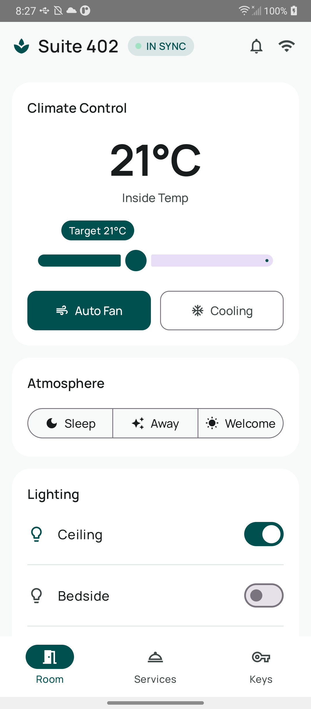
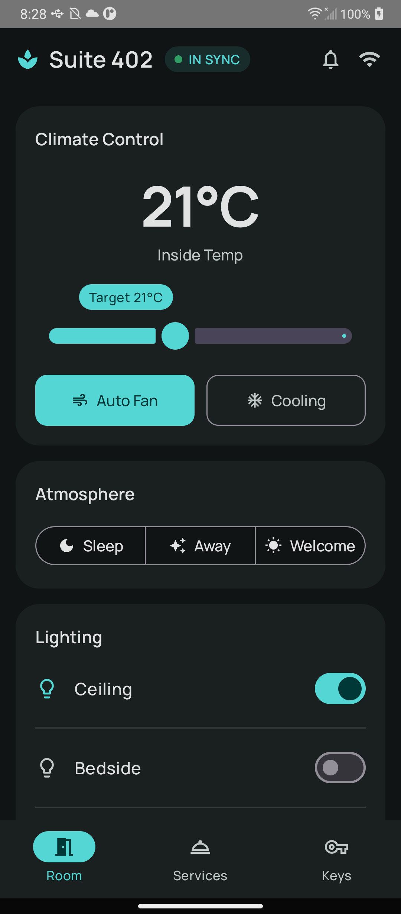
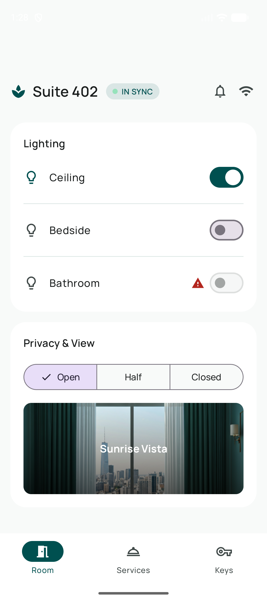
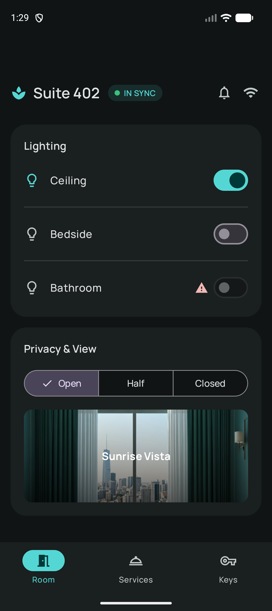

# Smart Guest Room Management

Android prototype for a smart hotel-room control app — built as a take-home assessment to demonstrate turning a loosely defined hospitality problem into a validated, prototyped, ready-for-real-solution Android application.

---

## Assessment Context

Source of truth: [`Product_Builder_Mobile_Android_Take_Home_Task.md`](Product_Builder_Mobile_Android_Take_Home_Task.md). The full requirement-by-requirement mapping is in [ASSESSMENT_ALIGNMENT.md](ASSESSMENT_ALIGNMENT.md).

---

## Problem Summary

Hotel rooms frustrate guests (confusing HVAC/lighting, key-card-in-slot power waste) and waste money for operators (HVAC/lighting in empty rooms is 40–60% of room energy spend). Hotels already have the IoT hardware — it's just locked to staff. This app puts simple, energy-aware control in the guest's phone, solving the guest experience and the energy bill together. Details in [PRODUCT_DISCOVERY.md](PRODUCT_DISCOVERY.md).

---

## Prototype Summary

- Multi-module, **feature-isolated Clean Architecture + MVVM** Android app in Kotlin.
- **Mock data only**, no backend — `mock` / `live` product flavors make the production seam real from day one.
- Core flow: a **Room Dashboard** with thermostat, climate modes (Auto Fan / Cooling), lights/blinds, and one-tap energy scenes (Sleep / Away / Welcome), driven by believable time-varying mock state.

**Current status (honest):** the modular foundation plus the **Controls/Dashboard** feature slice (domain/data/presentation) are built and run on the `mock` flavor — thermostat, climate modes, lights, blinds, and one-tap energy scenes over believable mock data. Other feature areas are documented, not coded. See [PROTOTYPE_OVERVIEW.md](PROTOTYPE_OVERVIEW.md) and [ASSESSMENT_ALIGNMENT.md](ASSESSMENT_ALIGNMENT.md).

**UI design source of truth:** [DESIGN.md](DESIGN.md) is the canonical spec for the UI. Edit it to drive UI changes — the implementation follows it.

---

## Screenshots

The Room Dashboard rendered on-device (`mock` flavor), built to the [DESIGN.md](DESIGN.md) "Serene Stay" spec — light and dark themes are structurally identical, only the color mapping changes.

| Light | Dark |
|---|---|
|  |  |
|  |  |

---

## Tech Stack

| Concern | Choice |
|---|---|
| Language / JDK | Kotlin 2.0.21 / JDK 17 |
| Build | Gradle Kotlin DSL + version catalog, AGP 8.7.3 |
| UI | Jetpack Compose (BOM 2024.12.01) + Material 3 |
| State | Coroutines 1.9.0, `StateFlow` / `SharedFlow` |
| Navigation | Navigation Compose 2.8.4 |
| DI | Hilt 2.52 |
| Min / target SDK | 26 / 35 |
| Testing | JUnit, Coroutines Test, Turbine, Truth |

---

## How to Run

> Requires **JDK 17** (the build targets Java 17; the machine-default JDK 25 is wrong — use `openjdk@17`). Gradle wrapper 9.5.1.

```bash
# Build the mock flavor
./gradlew :app:assembleMockDebug

# Install on a running emulator/device
./gradlew :app:installMockDebug
```

Then launch the app from the device. Use the `mock` flavor for the demo — no backend or hardware required.

---

## How to Test

```bash
./gradlew test                      # unit tests
./gradlew :app:assembleMockDebug    # verify the app builds from a clean checkout
```

Testing strategy (domain use-case, ViewModel state via Turbine, Compose smoke tests) is described in [ARCHITECTURE.md](ARCHITECTURE.md) and [project-structure-blueprint.md](project-structure-blueprint.md) §8.

---

## Known Limitations

Honest scope of the prototype — what it deliberately does **not** do yet:

- **Mock data only, no backend or hardware.** The `live` flavor is an honest *disconnected* stub: it emits one neutral snapshot (climate `OFF`) so the dashboard renders, and every command returns a clear "not connected" error. Use the `mock` flavor for the demo.
- **No state persistence.** The mock room state is in-memory; it resets on process death and configuration changes (e.g. rotation). Persisting it is tracked in [ROADMAP.md](ROADMAP.md) → Phase 1.5 Tier 3.
- **Single hard-coded room** ("Suite 402"). No room selection, authentication, or multi-room support.
- **Only the Controls/Dashboard feature is functional.** The **Services** and **Keys** bottom-nav tabs are lightweight "Coming soon" placeholders; the real Access/Keyless-entry slice is Phase 1.5 Tier 4.
- **Compose UI smoke test deferred** (needs Robolectric/emulator). UI and navigation are "build-alongside" — covered by compilation and manual on-device verification, not unit tests. Domain, data, and ViewModel logic *are* unit-tested ([TESTING_STRATEGY.md](TESTING_STRATEGY.md)).
- **The faulty device is a demo seam.** The Bathroom light is deliberately "unreachable" to show the error path; its switch is disabled with a warning indicator, so the error surfaces visually rather than via a snackbar on that row.
- **Internal dispatcher injection pending.** `provideControlsScope` hardcodes `Dispatchers.Default` instead of an injected qualified dispatcher — tracked in [ROADMAP.md](ROADMAP.md) → Phase 1.5 Tier 3.

---

## Project Structure

```text
app/                     Composition root, Android app, mock/live flavors, root NavHost
core/common/             Result wrappers + dispatcher qualifiers (technical only)
core/ui/                 Material 3 theme, design tokens, generic UI primitives
feature/<name>/          Per-feature domain / data / presentation (added per slice)
docs/                    Architecture notes, ADRs, design baselines, process
specifications/          Detailed product & technical specs (source material)
```

Feature modules own their own `domain`, `data`, and `presentation`; shared `core` modules are technical only (no shared `:core:domain` / `:core:data`). See [project-structure-blueprint.md](project-structure-blueprint.md).

---

## Documentation Map

| Document | Purpose |
|---|---|
| [ASSESSMENT_ALIGNMENT.md](ASSESSMENT_ALIGNMENT.md) | Requirement-by-requirement mapping to evidence |
| [PRODUCT_DISCOVERY.md](PRODUCT_DISCOVERY.md) | Problem, personas, validation, experiments |
| [PROTOTYPE_OVERVIEW.md](PROTOTYPE_OVERVIEW.md) | Core flow, screens, mock-data strategy |
| [ARCHITECTURE.md](ARCHITECTURE.md) | Modular architecture and future evolution |
| [DELIVERY_STRATEGY.md](DELIVERY_STRATEGY.md) | MVP, speed vs. robustness, production path |
| [ADOPTION_METRICS.md](ADOPTION_METRICS.md) | Adoption plan and success metrics |
| [NO_PM_NO_DESIGNER.md](NO_PM_NO_DESIGNER.md) | Solo prioritisation and UX quality |
| [AI_DEVELOPMENT.md](AI_DEVELOPMENT.md) | How AI helped; where humans decided |
| [DEMO_SCRIPT.md](DEMO_SCRIPT.md) | Live commented demo narrative |
| [ROADMAP.md](ROADMAP.md) | Phased delivery timeline |
| [TODO.md](TODO.md) | Out-of-scope future work |
| [VALIDATION_CHECKLIST.md](VALIDATION_CHECKLIST.md) | Pre-submission / pre-demo gate |
| [TESTING_STRATEGY.md](TESTING_STRATEGY.md) | Test pyramid and per-slice coverage |
| [CI_CD.md](CI_CD.md) | CI strategy and future production CD path |
| [CONVENTIONS.md](CONVENTIONS.md) | Coding, naming, and process conventions |
| [GLOSSARY.md](GLOSSARY.md) | Domain, technical, and product vocabulary |
| [AGENTS.md](AGENTS.md) | Operating guide for AI/human contributors |
| [CONTEXT.md](CONTEXT.md) | Fast orientation snapshot |
| [MEMORY.md](MEMORY.md) | Durable project decision log |
| [project-structure-blueprint.md](project-structure-blueprint.md) | Structural source of truth |
| [docs/](docs/) | Architecture notes, ADRs, design & process |
| [specifications/](specifications/) | Detailed source specifications |

Process reference: [Branching & pull request strategy](docs/development/branching-and-pull-requests.md).

---

## License

Prepared as a take-home technical assessment. No production license is attached.
